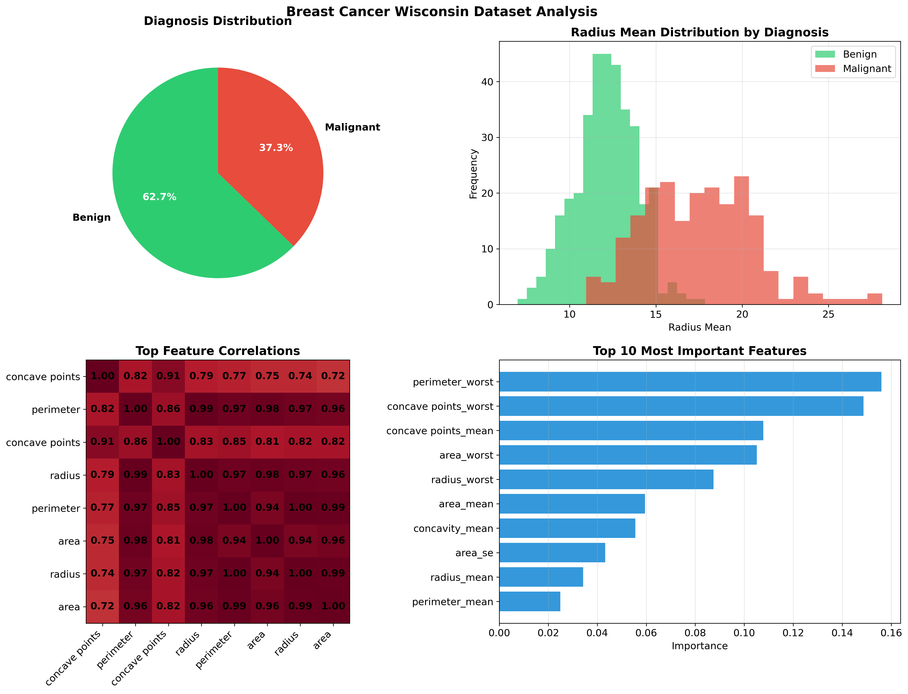

# Breast Cancer Detection Analysis

A comprehensive machine learning analysis of the Wisconsin Breast Cancer dataset using various visualization techniques and statistical methods.

## Project Overview

This project analyzes breast cancer data to distinguish between malignant and benign tumors using feature analysis, correlation studies, and machine learning insights.

## Key Visualizations

The analysis generates a comprehensive dashboard with four key visualizations:



### 1. Diagnosis Distribution
- Pie chart showing the proportion of benign vs malignant cases
- Color-coded for easy interpretation (green = benign, red = malignant)

### 2. Radius Mean Distribution
- Histogram comparing radius mean values between benign and malignant cases
- Shows clear separation between the two classes

### 3. Feature Correlation Heatmap
- Displays correlations between the top 8 most important features
- Uses a red-blue color scale with correlation values

### 4. Feature Importance
- Bar chart showing the top 10 most important features as determined by Random Forest
- Helps identify which features contribute most to classification

## Dataset

The Wisconsin Breast Cancer Dataset contains:
- 569 samples with 30 features each
- Features computed from digitized images of fine needle aspirates
- Target variable: diagnosis (M = malignant, B = benign)

## Code Features

- Data loading and preprocessing
- Comprehensive visualization suite
- Statistical analysis of key features
- Feature importance ranking using Random Forest
- Correlation analysis between features

## Requirements

```bash
pandas
numpy
matplotlib
seaborn
scikit-learn
